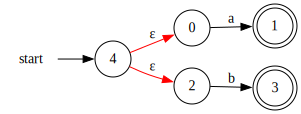
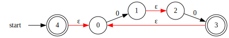
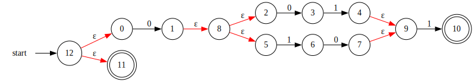

# Basic regex
A basic regex "engine" for educational purposes (school project)

The input regex string is parsed with a simple recursive descent parser and the NFA structure is built up from that.
NFA to DFA conversion is not implemented the NFA is executed in a recursive manner taking all possible paths in order
to decide if the input string is detected or not.

## Build

## Usage
Union operator match a or b `a+b`

Concatenation operator `ab` you can use `^` to define multiple concatenations `a^3` is equivalent to `aaa`

Kleene iteration matches a or nothing (epsilon) `a*`

Match nothing is defined as the dollar symbol `$`

The operator precedence is `parens > kleene > concat > union`

### A few example regexes and the resulting NFA

### `a+b`

### `(0^2)*`

## `0(01+10)1+$`

